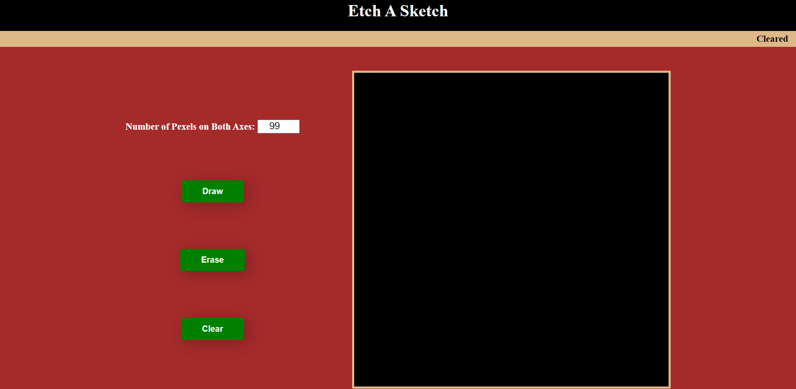

# Etch-a-Sketch
This a sketch board allowing users to Draw, and Erase by hovering over the board. They can also Clear it to restart fresh with desired Pixel size. 

## My Contribution and Learnings
The HTML, CSS, and JavaScript code in this project is entirely written by me. The most challenging part of this project was to change the pixel size, which pushed me to sharpen my JavaScript and DOM Manipulation skills. In this project I got to learn about event listeners.

